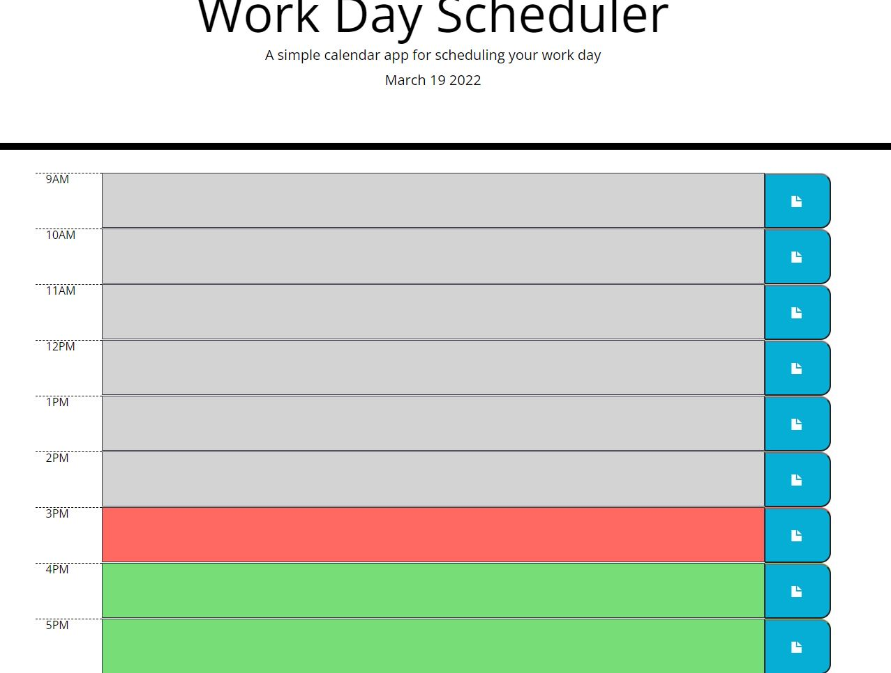

# Work Day Scheduler 

Allows users to click on boxes for time slots and enter tasks they would like to complete.
Text editor will exit upon clicking out of the block, users must click on the blue save button for each time slot in order to save their tasks.

Tasks will be persistent, and load upon refreshing the page.

In order to delete a task a user must click on the slot and manually erase the task, and then click the save button again.

Scheduler will audit the current time and color the time slots based on whether they are past due or not upon refresh.

Live Link: https://meshuganah.github.io/work-day-scheduler/

